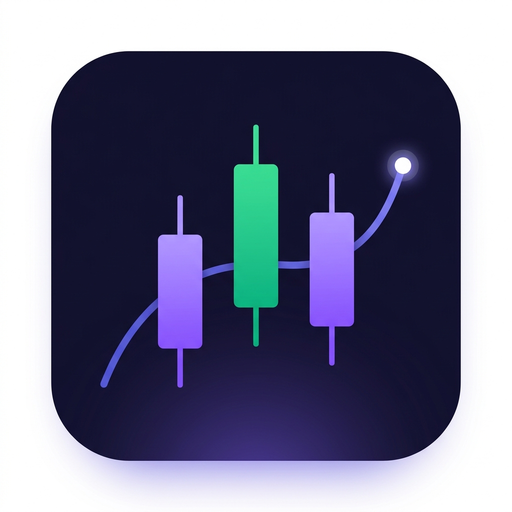

<p align="center">
  
</p>

<h1 align="center">StockSense</h1>

<p align="center">
  <strong>AI-Powered Real-Time Stock Prediction Dashboard</strong>
</p>

<p align="center">
  <a href="https://stock-sense-ruddy.vercel.app/" target="_blank"><strong>🌐 Live Demo: stock-sense-ruddy.vercel.app</strong></a>
</p>

<p align="center">
  
  
  
  
  
  
</p>

<p align="center">
  A premium, dark-themed stock analysis dashboard with live market data, interactive candlestick charts, 3 ML-powered prediction models, technical indicators, and multi-currency support for global stocks.
</p>

---

## ✨ Features

### 📊 Real-Time Market Data
- **Dual API Architecture** — Finnhub as primary source, Yahoo Finance as automatic fallback
- **Live Price Updates** — Auto-refreshes every 10 seconds during market hours
- **Multi-Currency Support** — Displays prices in native currency (USD, INR, EUR, GBP, JPY, etc.)
- **No Caching** — All data fetched live with `cache: 'no-store'` for maximum accuracy

### 🤖 AI Prediction Models
| Model | Type | Description |
|-------|------|-------------|
| **Trend** | Prophet-style | Seasonal pattern analysis with exponential weighted trends |
| **Momentum** | LSTM-style | Short-term price movement detection using momentum signals |
| **Statistical** | ARIMA-style | Math-based statistical forecasting with confidence intervals |

### 📈 Interactive Charts
- **Candlestick & Line** chart toggle powered by TradingView's Lightweight Charts
- **Prediction Overlay** with color-coded forecast lines and confidence bands
- **Custom Hover Tooltips** with OHLC data, forecast targets, and range boundaries
- **Adjustable Prediction Window** — 3 to 30 day forecast slider

### 🔍 Smart Search
- **⌘K / Ctrl+K** keyboard shortcut for instant search
- **Autocomplete** with Finnhub ticker search + Yahoo Finance fallback
- **Global Stock Support** — Search US (AAPL), Indian (RELIANCE.NS), European, and more

### 📱 Responsive Design
- **Desktop** — Two-column layout with sidebar watchlist, news feed, and AI insights
- **Mobile** — Collapsed layout with horizontal watchlist strip and stacked components
- **Glassmorphic UI** — Dark theme with subtle gradients, animations, and micro-interactions

### 📋 Additional Features
- **Watchlist** — 6-stock sidebar with live prices, logos, and quick switching
- **Stock Stats** — Market Cap, 52W High/Low, Volume, P/E Ratio, Beta
- **Technical Indicators** — RSI Gauge and MACD with signal analysis
- **AI Insight Card** — Sentiment analysis, confidence scores, and price targets
- **News Feed** — Latest company news from Finnhub (gracefully hidden on errors)
- **CSV Export** — Download historical + predicted data as CSV
- **Company Logos** — Clearbit logo integration with fallback mappings
- **LocalStorage Persistence** — Remembers your last viewed stock across sessions

---

## 🚀 Quick Start

### Prerequisites
- **Node.js** 18+ and **npm**
- **Python** 3.10+ (optional, for ML predictions)
- **Finnhub API Key** — [Get free key here](https://finnhub.io)

### 1. Clone the Repository
```bash
git clone https://github.com/prashantxbuilds/stocksense.git
cd stocksense
```

### 2. Install Dependencies
```bash
npm install
```

### 3. Configure Environment
Create a `.env.local` file in the project root:
```env
FINNHUB_API_KEY=your_finnhub_api_key_here
ML_SERVICE_URL=http://localhost:8000
```

### 4. Start the Development Server
```bash
npm run dev
```
Open [http://localhost:3000](http://localhost:3000) in your browser.

### 5. Start ML Service (Optional)
```bash
cd ml
pip install -r requirements.txt
python app.py
```
ML service runs at [http://localhost:8000](http://localhost:8000).

> **Note:** The dashboard works fully without the ML service — only prediction overlays require it.

---

## 🏗️ Architecture

```
┌─────────────────────────────────────────────────────────────┐
│                        Browser (Client)                      │
│  ┌──────────┐ ┌───────────┐ ┌──────────┐ ┌───────────────┐  │
│  │  Topbar   │ │StockChart │ │Watchlist  │ │  AI Insight   │  │
│  │ (Search)  │ │(LW Charts)│ │(Sidebar)  │ │  + NewsFeed   │  │
│  └──────────┘ └───────────┘ └──────────┘ └───────────────┘  │
│  ┌──────────┐ ┌───────────┐ ┌──────────┐ ┌───────────────┐  │
│  │StockStats │ │Indicators │ │Prediction│ │ PredictionBand│  │
│  │          │ │(RSI/MACD) │ │ Controls │ │               │  │
│  └──────────┘ └───────────┘ └──────────┘ └───────────────┘  │
└───────────────────────┬─────────────────────────────────────┘
                        │ API Calls
┌───────────────────────▼─────────────────────────────────────┐
│                   Next.js API Routes                         │
│  /api/quote/[symbol]     /api/candles/[symbol]               │
│  /api/profile/[symbol]   /api/financials/[symbol]            │
│  /api/search/[query]     /api/news/[symbol]                  │
│  /api/predict (→ Flask)                                      │
└──────┬──────────────┬───────────────────────┬───────────────┘
       │              │                       │
  ┌────▼────┐   ┌─────▼─────┐          ┌─────▼─────┐
  │ Finnhub │   │  Yahoo    │          │  Flask ML │
  │  (1st)  │   │ Finance   │          │  Service  │
  │         │   │  (2nd)    │          │ Port 8000 │
  └─────────┘   └───────────┘          └───────────┘
```

### API Fallback Strategy
Every API route follows this pattern:
1. **Try Finnhub first** — Fast, reliable for US stocks
2. **Fallback to Yahoo Finance** — Handles international stocks (NSE, BSE, LSE, etc.)
3. **Graceful degradation** — Returns empty/fallback data instead of errors

---

## 📁 Project Structure

```
stocksense/
├── app/
│   ├── layout.jsx                  # Root layout, SEO meta, favicons
│   ├── page.jsx                    # Main dashboard (state management, UI)
│   ├── globals.css                 # Global styles, animations, scrollbar
│   └── api/
│       ├── quote/[symbol]/         # Live price quote
│       ├── candles/[symbol]/       # OHLCV historical data
│       ├── profile/[symbol]/       # Company info, logo, exchange
│       ├── financials/[symbol]/    # 52W range, P/E, beta, volume
│       ├── search/[query]/         # Ticker search autocomplete
│       ├── news/[symbol]/          # Company news articles
│       └── predict/                # Proxy to Flask ML service
│
├── components/
│   ├── Topbar.jsx                  # Logo, search bar, live indicator
│   ├── StockChart.jsx              # TradingView Lightweight Charts
│   ├── PredictionControls.jsx      # Timeframe + model + chart toggle
│   ├── PredictionBand.jsx          # Price range band + sentiment
│   ├── StockStats.jsx              # Market cap, 52W, volume, P/E, beta
│   ├── Indicators.jsx              # RSI gauge + MACD analysis
│   ├── Watchlist.jsx               # Sidebar with live stock prices
│   ├── AIInsight.jsx               # AI confidence + forecast card
│   └── NewsFeed.jsx                # Company news feed
│
├── lib/
│   ├── finnhub.js                  # Finnhub API helpers (no-cache)
│   ├── yahoo.js                    # Yahoo Finance wrapper (yahoo-finance2)
│   └── utils.js                    # Currency formatting, logo helpers
│
├── ml/
│   ├── app.py                      # Flask ML microservice
│   └── requirements.txt            # Python dependencies
│
├── public/                         # Favicons, PWA icons, manifest
├── .env.local                      # API keys (gitignored)
├── package.json                    # Node dependencies
├── tailwind.config.js              # Tailwind configuration
└── next.config.mjs                 # Next.js configuration
```

---

## 🧠 ML Models Deep Dive

The prediction engine runs as a standalone Flask microservice and supports 3 models:

### Trend Model (Prophet-style)
- Uses **Exponentially Weighted Moving Averages** (EWM) to detect seasonal trends
- Applies **mean reversion** to prevent unrealistic price drift
- Best for: Stocks with clear cyclical patterns

### Momentum Model (LSTM-style)
- Analyzes **5-day momentum slope** as primary price driver
- Applies **4% daily decay** to prevent runaway predictions
- Best for: Volatile stocks with strong directional movement

### Statistical Model (ARIMA-style)
- Blends **short-term momentum** with **long-term moving average regression**
- Uses **z = 1.44 multiplier** for 85% confidence bands
- Best for: Stable stocks where historical patterns repeat

### ML API Endpoint
```http
POST http://localhost:8000/predict
Content-Type: application/json

{
  "symbol": "AAPL",
  "days": 7,
  "model": "prophet",
  "prices": [150.2, 151.3, ...],
  "dates": ["2024-01-01", ...]
}

Response:
{
  "symbol": "AAPL",
  "model": "prophet",
  "days": 7,
  "predicted": [152.1, 153.4, ...],
  "upper": [155.2, 156.8, ...],
  "lower": [149.0, 150.1, ...],
  "dates": ["2024-01-08", ...],
  "confidence": 0.85,
  "sentiment": "BULLISH"
}
```

---

## 🎨 Design System

| Token | Hex | Usage |
|-------|-----|-------|
| Background | `#080c18` | Page background |
| Surface | `#0d1020` | Cards, panels |
| Purple | `#7c6fee` | Trend model, primary accent |
| Purple Light | `#a78bfa` | Highlights, active states |
| Green | `#4ade80` | Momentum model, bullish, gains |
| Orange | `#fb923c` | Statistical model |
| Red | `#f87171` | Bearish, losses, errors |

---

## 🌍 Supported Markets

| Region | Suffix | Currency | Example |
|--------|--------|----------|---------|
| US | — | USD ($) | AAPL, TSLA, NVDA |
| India (NSE) | .NS | INR (₹) | RELIANCE.NS, INFY.NS |
| India (BSE) | .BO | INR (₹) | RELIANCE.BO |
| UK (LSE) | .L | GBP (£) | HSBA.L |
| Germany | .DE | EUR (€) | SAP.DE |
| Canada (TSX) | .TO | CAD (C$) | SHOP.TO |
| Australia | .AX | AUD (A$) | CBA.AX |
| Hong Kong | .HK | HKD (HK$) | 0700.HK |

---

## 🛠️ Tech Stack

| Layer | Technology |
|-------|-----------|
| **Framework** | Next.js 14 (App Router) |
| **UI Library** | React 18 |
| **Styling** | Tailwind CSS 3.4 + Custom CSS |
| **Charts** | TradingView Lightweight Charts 5 |
| **Primary API** | Finnhub (REST) |
| **Fallback API** | Yahoo Finance (yahoo-finance2) |
| **ML Service** | Python Flask |
| **ML Libraries** | NumPy, Pandas |
| **Language** | JavaScript (ES Modules) |

---

## 📄 License

This project is open source and available under the [MIT License](LICENSE).

---

<p align="center">
  Built with ❤️ by <a href="https://github.com/prashantxbuilds">prashantxbuilds</a>
</p>
